Vermont Watersheds: Regressions and Trend Analyses
================
Andrea J. Elhajj
6/8/2019

## Part 1: Analysis of New Haven River and Little Otter Creek

My team and I are interested in analysing hydrological data collected
from Vermont watersheds. This data set contains mean Turbidity values
(in NTUs) and mean Total Phosphorus (TP) concentrations (in ug/L)
measured at five water quality monitoring stations in the Little Otter
Creek watershed and six stations in the New Haven River watershed.

Also included are the percentages of agricultural land use (Perc\_Ag)
and percentages of glaciolacustrine soils (Perc\_GL) contained in the
immediate river corridor of the incremental watershed areas draining to
each station. Glaciolacustrine soils are silt- and clay-rich sediments
deposited in fresh-water of marine-water lakes by glacial meltwater.

Let’s begin. First, we will read in and view the data set:

``` r
library(readr)
library(ggplot2)
```

    ## Registered S3 methods overwritten by 'ggplot2':
    ##   method         from 
    ##   [.quosures     rlang
    ##   c.quosures     rlang
    ##   print.quosures rlang

``` r
library(ggpmisc)
```

    ## For news about 'ggpmisc', please, see https://www.r4photobiology.info/

``` r
library(Kendall)
library(dplyr)
```

    ## 
    ## Attaching package: 'dplyr'

    ## The following objects are masked from 'package:stats':
    ## 
    ##     filter, lag

    ## The following objects are masked from 'package:base':
    ## 
    ##     intersect, setdiff, setequal, union

``` r
df <- read_csv("WQ_LOC_NHR.csv")
```

    ## Parsed with column specification:
    ## cols(
    ##   Watershed = col_character(),
    ##   WQ_Subwatershed = col_character(),
    ##   Incr_Area_sqmi = col_double(),
    ##   Perc_GL = col_double(),
    ##   Perc_Ag = col_double(),
    ##   Turb_mn = col_double(),
    ##   TP_mn = col_double()
    ## )

``` r
df
```

    ## # A tibble: 11 x 7
    ##    Watershed WQ_Subwatershed Incr_Area_sqmi Perc_GL Perc_Ag Turb_mn TP_mn
    ##    <chr>     <chr>                    <dbl>   <dbl>   <dbl>   <dbl> <dbl>
    ##  1 LOC       LOC4.3                   1.03   92.3     71.5    59.9  136. 
    ##  2 LOC       LOC7.8                   1.14   80.2     52.8    74.9  168. 
    ##  3 LOC       LOC10                    3.06   73.2     58.5    50.6  156. 
    ##  4 LOC       LOC14.4                  1.18   55.5     49.9    40.2  154. 
    ##  5 LOC       MDC1.2                   1.17   91.4     69.8    25.9  205. 
    ##  6 NHR       NHR0.5                   0.37   50.2     60.8     6.05  28.7
    ##  7 NHR       NHR2                     3.97   38.3     34.4     7.05  30.4
    ##  8 NHR       NHR6                     0.729  24.3     41.9     2.09  16.7
    ##  9 NHR       NHR9                     1.87    0.825    7.44    2.14  21.8
    ## 10 NHR       NHR11.5                  2.74    0.323    6.25    1.13  12.5
    ## 11 NHR       NHR15                    2.73    0.325    4.31    1.17  11.3

Before conducting a regression analysis, we must investigate whether or
not these variables (TP\_mn, Turb\_mn, Perc\_GL, and Perc\_Ag) are
normally distributed. We can run the Shapiro-Wilks Test for Normality at
the 95% confidence level. The null hypothesis of this test states that
the data are normally distributed. As the output shows below, this test
indicates that the variables TP\_mn and Turb\_mn are not normally
distributed:

``` r
shapiro.test(df$TP_mn) # p-value = 0.01027, alpha = 0.05, reject null 
```

    ## 
    ##  Shapiro-Wilk normality test
    ## 
    ## data:  df$TP_mn
    ## W = 0.8029, p-value = 0.01027

``` r
shapiro.test(df$Turb_mn) # p-value = 0.02182, reject null
```

    ## 
    ##  Shapiro-Wilk normality test
    ## 
    ## data:  df$Turb_mn
    ## W = 0.82776, p-value = 0.02182

``` r
shapiro.test(df$Perc_GL) # p-value = 0.1698, fail to reject null
```

    ## 
    ##  Shapiro-Wilk normality test
    ## 
    ## data:  df$Perc_GL
    ## W = 0.89699, p-value = 0.1698

``` r
shapiro.test(df$Perc_Ag) # p-value = 0.09962, fail to reject null
```

    ## 
    ##  Shapiro-Wilk normality test
    ## 
    ## data:  df$Perc_Ag
    ## W = 0.87851, p-value = 0.09962

The output of these tests suggest the following:

1.  TP\_mn: we reject the null in favor of the alternate (p = 0.01).
    This variable is not likely to be normally distributed.
2.  Turb\_mn: we reject the null in favor of the alternate (p = 0.02).
    This variable is not likely to be normally distributed.
3.  Perc\_GL: we accept the null hypothesis that this variable is
    normally distributed (p = 0.17).
4.  Perc\_Ag: we accept the null hypothesis that this variable is
    normally distributed (p = 0.10).

We can further investigate this by creating quantile-quantile plots,
also known as Q-Q plots. On a Q-Q plot, normally distributed data
appears as roughly a straight line (although the ends of the Q-Q plot
may start to deviate from the straight line).

``` r
ggplot(df, aes(sample = TP_mn)) + 
  stat_qq() +
  geom_qq_line(col = "blue") + 
  labs(x = "Theoretical Quantiles",
       y = "Mean Total Phosphorous (ug/L)")
```

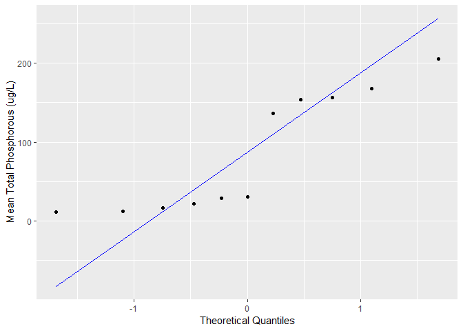<!-- -->

``` r
ggplot(df, aes(sample = Turb_mn)) + 
  stat_qq() +
  geom_qq_line(col = "blue") + 
  labs(x = "Theoretical Quantiles",
       y = "Mean Turbidity Values (NTU)")
```

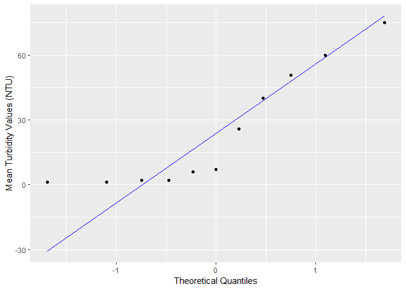<!-- -->

``` r
ggplot(df, aes(sample = Perc_GL)) + 
  stat_qq() +
  geom_qq_line(col = "blue") + 
  labs(x = "Theoretical Quantiles",
       y = "Percent Glaciolacustrine Soils (%)")
```

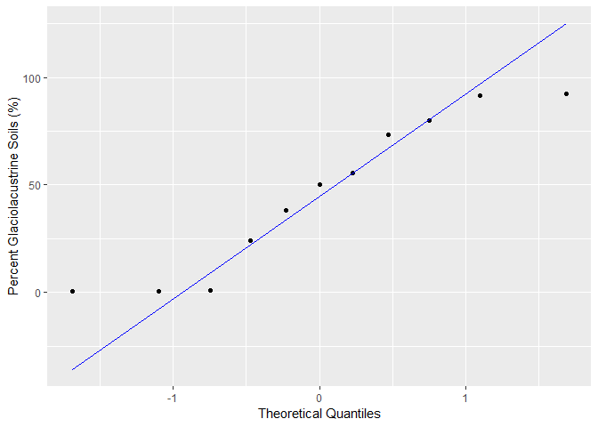<!-- -->

``` r
ggplot(df, aes(sample = Perc_Ag)) + 
  stat_qq() +
  geom_qq_line(col = "blue") + 
  labs(x = "Theoretical Quantiles",
       y = "Percent Agricultural Land Use (%)")
```

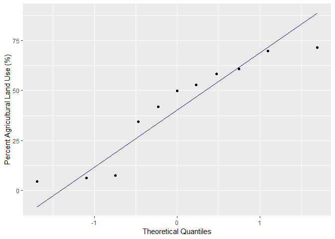<!-- -->

From visual inspection of these Q-Q plots, the variables TP\_mn and
Turb\_mn do not appear to be normally distributed.

But what do the density distributions of these variables look like? Do
they further confirm our suspicions?

``` r
ggplot(df, aes(x = TP_mn)) + 
  geom_density() +
  xlab("Mean Total Phosphorous (ug/L)")
```

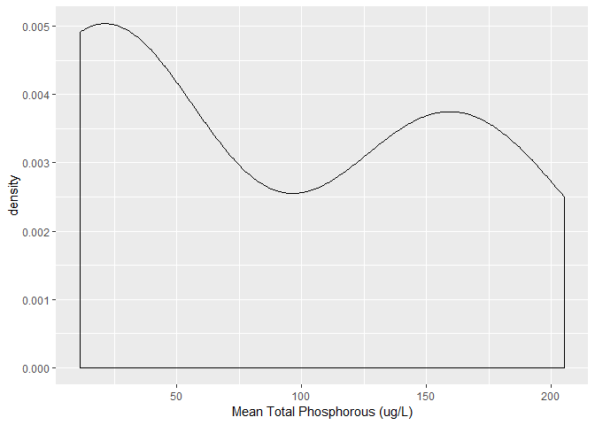<!-- -->

``` r
ggplot(df, aes(x = Turb_mn)) + 
  geom_density() +
  xlab("Mean Turbidity Values (NTU)")
```

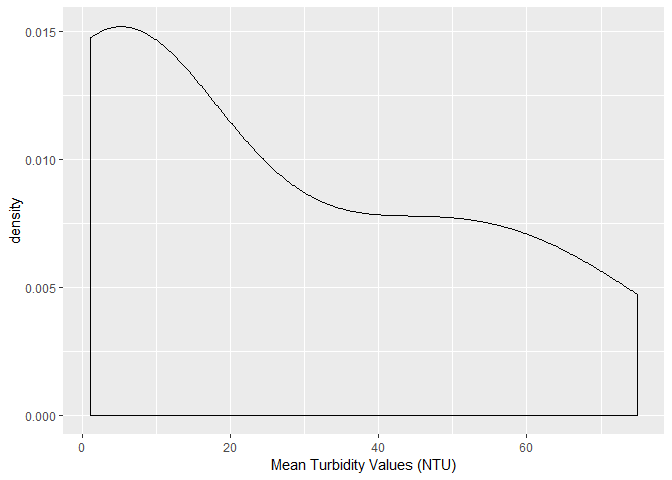<!-- -->

``` r
ggplot(df, aes(x = Perc_GL)) + 
  geom_density() +
  xlab("Percent Glaciolacustrine Soils (%)")
```

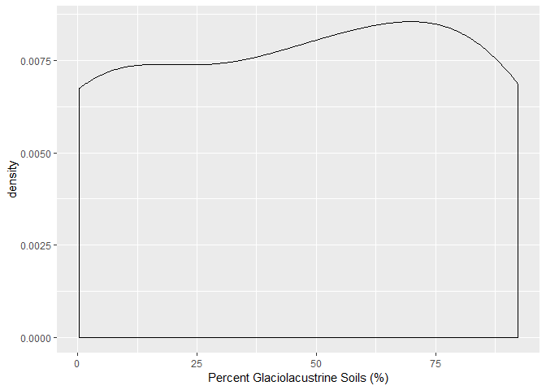<!-- -->

``` r
ggplot(df, aes(x = Perc_Ag)) + 
  geom_density() +
  xlab("Percent Agricultural Land Use (%)")
```

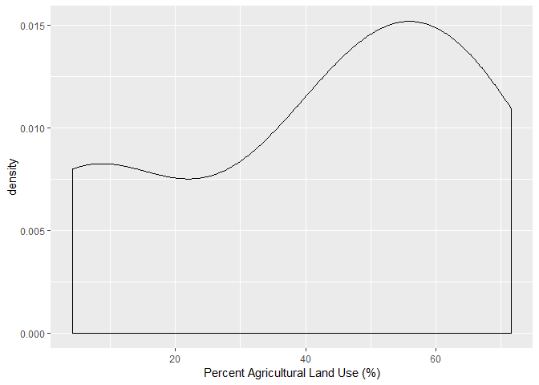<!-- -->

Yes, they do. We are confident that Perc\_GL and Perc\_Ag are normally
distributed variables, while TP\_mn and Turb\_mn are not.

Because this is raw data from a real-world example, we cannot expect
perfect bell curves. However, the bimodal distribution curves for the
variables TP\_mn and Turb\_mn further build our case that they are not
normally distributed.

Therefore, we shall transform these water quality variables using a
log10 tranformation:

``` r
df$log10_TP_mn <- log10(df$TP_mn)
df$log10_Turb_mn <- log10(df$Turb_mn)
```

Did this work to transform the data to a nearly normal distribution?
Let’s check the Q-Q plots:

``` r
ggplot(df, aes(sample = log10_TP_mn)) + 
  stat_qq() +
  geom_qq_line(col = "blue") + 
  labs(x = "Theoretical Quantiles",
       y = "log10[Mean Total Phosphorous (ug/L)]")
```

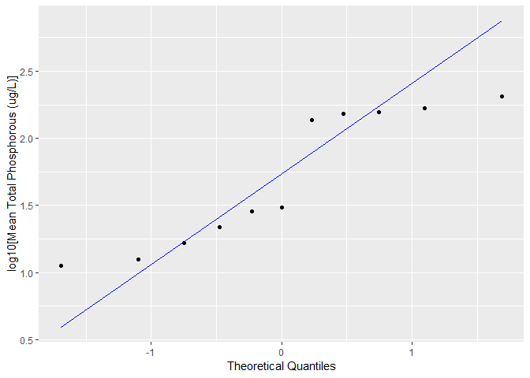<!-- -->

``` r
ggplot(df, aes(sample = log10_Turb_mn)) + 
  stat_qq() +
  geom_qq_line(col = "blue") + 
  labs(x = "Theoretical Quantiles",
       y = "log10[Mean Turbidity (NTU)]")
```

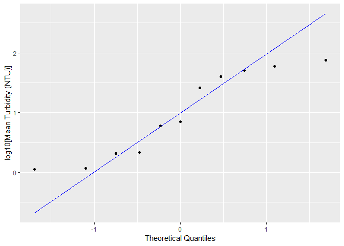<!-- -->

Turb\_mn seems to have improved much more from this transformation than
TP\_mn. We can see that in this transformed Turb-mn Q-Q plot, the
deviations from the straight line are minimal when compared to the
non-transformed plot above. Visual inspection shows us that there is
slight improvement to the TP\_mn variable.

Next, let’s visualize the data:

``` r
ggplot(df, aes(x = Perc_GL, y = log10_Turb_mn)) + 
  geom_point() +
  labs(x = "Percent Glaciolacustrine Soils (%)",
       y = "log10[Mean Total Phosphorus (ug/L)]")
```

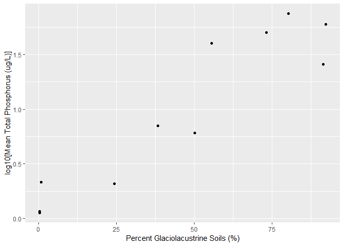<!-- -->

``` r
ggplot(df, aes(x = Perc_GL, y = log10_Turb_mn)) + 
  geom_point() +
  labs(x = "Percent Glaciolacustrine Soils (%)",
       y = "log10[Mean Turbidity Values (NTU)]")
```

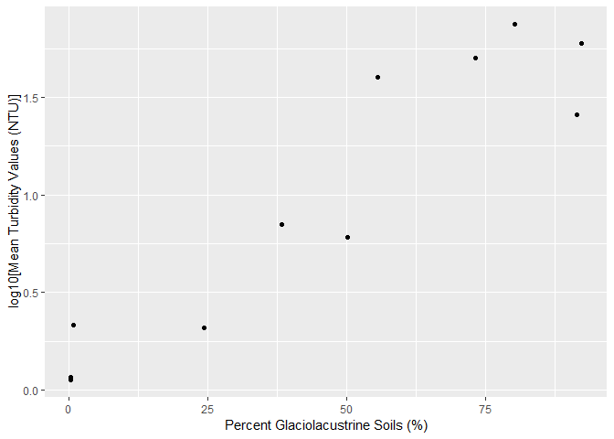<!-- -->

``` r
ggplot(df, aes(x = Perc_Ag, y = log10_TP_mn)) + 
  geom_point() +
  labs(x = "Percent Agricultural Land Use (%)",
       y = "log10[Mean Total Phosphorus (in ug/L)]")
```

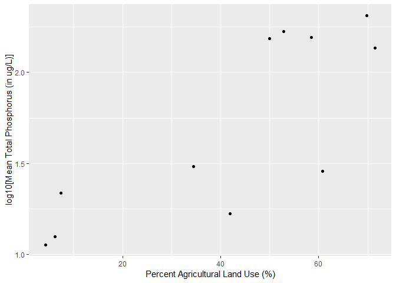<!-- -->

``` r
ggplot(df, aes(x = Perc_Ag, y = log10_Turb_mn)) + 
  geom_point() +
  labs(x = "Percent Agricultural Land Use (%)",
       y = "log10[Mean Turbidity Values (NTU)]")
```

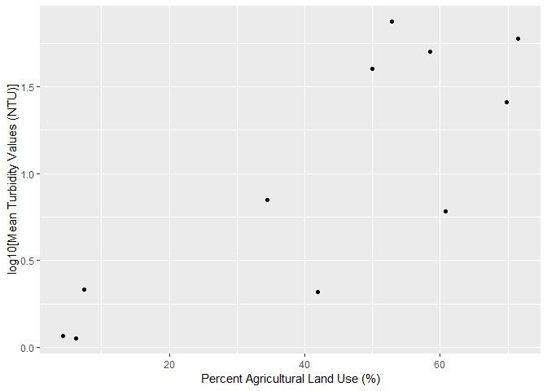<!-- -->

We will now calculate Pearson correlation coefficients to assess the
strength of these linear relationships:

``` r
cor(df$Perc_GL, df$log10_TP_mn, method = c("pearson"))
```

    ## [1] 0.9231598

``` r
cor(df$Perc_GL, df$log10_Turb_mn, method = c("pearson"))
```

    ## [1] 0.9318165

``` r
cor(df$Perc_Ag, df$log10_TP_mn, method = c("pearson"))
```

    ## [1] 0.8047242

``` r
cor(df$Perc_Ag, df$log10_Turb_mn, method = c("pearson"))
```

    ## [1] 0.8236255

All Pearson correlation coefficients are above 0.80, indicating strong
linear relationships between respective variables.

The watershed group believes that total phosphorus concentrations in
these rivers are caused by agricultural land use. To investigate this,
we will construct a simple linear regression model that relates total
phospohorous to agricultural land use:

``` r
x = df$Perc_Ag
y = df$log10_TP_mn
formula <- y ~ x

ggplot(df, aes(x = Perc_Ag, y = log10_TP_mn)) + 
  geom_point() +
  stat_smooth(method = "lm", formula = y ~ x, se = FALSE) + 
  labs(x = "Percent Agricultural Land Use (%)",
       y = "log10[Mean Total Phosphorus (in ug/L)]") +
  stat_poly_eq(aes(label = paste(..eq.label.., ..rr.label.., sep = "~~~")), 
               label.x.npc = "right", label.y.npc = 0.15,
               formula = formula, parse = TRUE, size = 3)
```

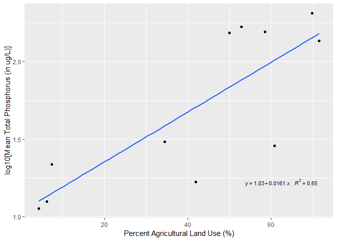<!-- -->

``` r
model <- lm(y~x)
summary(model)
```

    ## 
    ## Call:
    ## lm(formula = y ~ x)
    ## 
    ## Residuals:
    ##      Min       1Q   Median       3Q      Max 
    ## -0.55104 -0.07507 -0.03269  0.20480  0.35174 
    ## 
    ## Coefficients:
    ##             Estimate Std. Error t value Pr(>|t|)    
    ## (Intercept) 1.029787   0.190525   5.405  0.00043 ***
    ## x           0.016111   0.003962   4.067  0.00281 ** 
    ## ---
    ## Signif. codes:  0 '***' 0.001 '**' 0.01 '*' 0.05 '.' 0.1 ' ' 1
    ## 
    ## Residual standard error: 0.3168 on 9 degrees of freedom
    ## Multiple R-squared:  0.6476, Adjusted R-squared:  0.6084 
    ## F-statistic: 16.54 on 1 and 9 DF,  p-value: 0.002814

The results of our linear regression analysis indicate that there is
indeed evidence of a relationship between percent agricultural land use
and mean total phosphorous for the Little Otter and New River catchments
at the 95% confidence level (F = 16.54, p \< 0.0028). The coefficient of
determination indicates that this model is a moderate fit for the data
(R^2 = 0.65).

The assumptions for a simple linear regression are as follows: linearity
of residuals, independence of residuals, normal distribution of
residuals, and equal variance of residuals.

Because the scatter plot follows a linear pattern (i.e. not a
curvilinear pattern), that shows that the linearity assumption is met.
Independence implies that each point is independent from every other
point, which we can also assume to be true. Normality was investigates
in our trials above and corrected with a log10 transformation. Lastly,
comes the equal variance assumption. The scatter plot shows that the
data may exhibit heteroscedasticity as the residuals of the scatter plot
tend to fan out at the midpoint of the x-axis. In the future, the
collection of more data points is recommended to further make this
judgement call.

The instream water quality criteria for TP in surface waters is 27
ug/L.  
We would like to calculate the percentage of agricultural land use
according to this model, so we will perform the following calculation:

``` r
PercentALU <- (log10(27)-1.03)/(0.16)
PercentALU
```

    ## [1] 2.508524

Our model predicts that 2.51% agricultural land use in the nearby
upstream river corridor corresponds to 27 ug/L Total Phosphorous in
surface waters.

Since phosphorus likes to sorb to fine silts and clays, TP may also be a
function of Turbidity levels. Let’s construct a multiple linear
regression model that relates TP to both agricultural land use and
Turb\_mn:

``` r
multi_model <- lm(df$log10_TP_mn ~ df$Perc_Ag + df$Turb_mn)
summary(multi_model)
```

    ## 
    ## Call:
    ## lm(formula = df$log10_TP_mn ~ df$Perc_Ag + df$Turb_mn)
    ## 
    ## Residuals:
    ##      Min       1Q   Median       3Q      Max 
    ## -0.23371 -0.16115 -0.04492  0.11996  0.35923 
    ## 
    ## Coefficients:
    ##             Estimate Std. Error t value Pr(>|t|)    
    ## (Intercept) 1.077224   0.132623   8.122 3.91e-05 ***
    ## df$Perc_Ag  0.008506   0.003588   2.371   0.0452 *  
    ## df$Turb_mn  0.010917   0.003322   3.286   0.0111 *  
    ## ---
    ## Signif. codes:  0 '***' 0.001 '**' 0.01 '*' 0.05 '.' 0.1 ' ' 1
    ## 
    ## Residual standard error: 0.2192 on 8 degrees of freedom
    ## Multiple R-squared:   0.85,  Adjusted R-squared:  0.8125 
    ## F-statistic: 22.67 on 2 and 8 DF,  p-value: 0.0005061

The results of our multiple linear regression analysis indicate that
there is indeed evidence of a relationship between percent agricultural
land use and mean total phosphorous for the Little Otter and New River
catchments at the 95% confidence level (F = 22.67, p = 0.0005). The
model is as
follows:

\[log10[Mean\;Total\;Phosphorous\;in\;ug/L] = 1.077 + (0.0085*Percent\;Agricultural \;Land\;Use)+(0.0109*log10[Mean\;Turbidity\;in\;NTU])\]

The model assumptions described above for the previous model are also
obeyed in the creation of this model, with the possible
heteroscedasticity as a slight concern. The coefficient of determination
in the above summary statistics shows us that this model is a strong fit
for the data (R^2 = 0.85). In comparision to our previous model, using a
multiple regression with both the percent agricultural land use and and
the mean turbidity values give us a better fit to the available data.
This tells us that this multiple regression model is a better
representation of our Earth system (i.e., the Little Otter and New River
catchments).

## Part 2: New Haven River and Little Otter Creek Watershed Data Analysis

For the second part of our investigation, we will be investigating daily
mean flow data for the Mad River, which is a tributary to the Winooski
River in Vermont. It has its headwaters in Granville Gulf, then flows
north through the towns of Warren, Waitsfield, and Moretown before
entering the Winooski River just downstream from Middlesex.

This set contains flow data from 1929 to 2015.

``` r
df_mad <- read_csv("Mad.csv")
```

    ## Parsed with column specification:
    ## cols(
    ##   Date = col_character(),
    ##   Discharge = col_double()
    ## )

``` r
head(df_mad)
```

    ## # A tibble: 6 x 2
    ##   Date     Discharge
    ##   <chr>        <dbl>
    ## 1 1/1/1929        56
    ## 2 1/2/1929        52
    ## 3 1/3/1929        50
    ## 4 1/4/1929        56
    ## 5 1/5/1929       111
    ## 6 1/6/1929       144

We would like to create a plot of the frequency by year (from year 1990
through 2015) when discharge exceeded the 95Th percentile (940 cfs).

We must select only rows with discharge value \> 940 cfs and subset the
data for the years 1990 to
2015:

``` r
df_mad$Date <- format(as.Date(df_mad$Date, format="%m/%d/%Y"),"%Y") # we are only interested in indexing data by year

df_exceed <- df_mad %>% 
  filter(Discharge > 940) %>%
  filter(Date >= 1990 & Date <= 2015)
```

Finally, we can create our barplot:

``` r
ggplot(data = df_exceed, aes(x = factor(Date))) +
  geom_bar(fill = "darkblue") + 
  theme(axis.text.x = element_text(angle = 90, hjust = 1)) + 
  labs(x = "Year", title = "95th Percentile Discharge Exceedences")
```

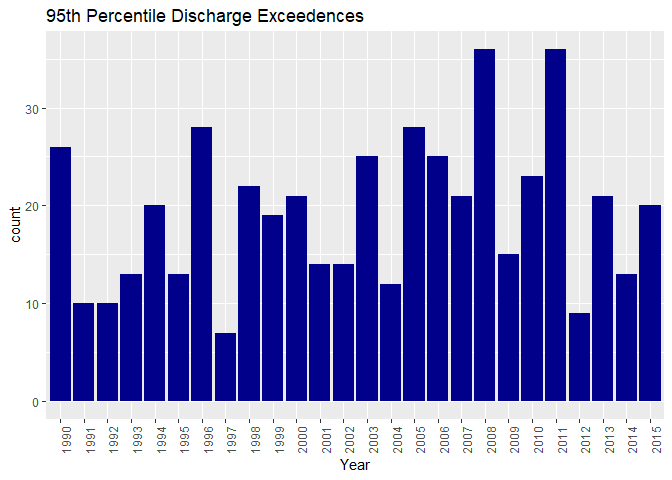<!-- -->

Next, we would like to fit a linear regression model to the record of
days per year. First, we will create new data frame to contain only the
year column and the frequencies (instead of the year column and actual
discharge values that are greater than the 95th percentile as we have
before):

``` r
df_freq <- as.data.frame(table(df_exceed$Date))
```

Is this data normally distributed? Let’s conduct the Shapiro-Wilks Test
for Normality:

``` r
shapiro.test(df_freq$Freq)
```

    ## 
    ##  Shapiro-Wilk normality test
    ## 
    ## data:  df_freq$Freq
    ## W = 0.95042, p-value = 0.2372

Because the p-value = 0.2372 and alpha = 0.05, we fail to reject null.
Let’s check the Q-Q plot to further ensure that the data is normally
distributed:

``` r
ggplot(df_freq, aes(sample = Freq)) + 
  stat_qq() +
  geom_qq_line(col = "blue") + 
  labs(x = "Theoretical Quantiles",
       y = "95th Percentile Discharge Exceedences")
```

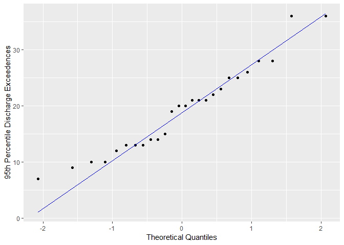<!-- -->

Yes, the data seems to pass the visual inspection from a Q-Q plot.
Despite fitting a normal distribution, a parametric model is not valid
for interpretation of trend. Why? Because the data is not independent
due to temporal dependence.

LOWESS (Locally Weighted Scatterplot Smoothing) Models are a great tool
in regression analyses for creating line through timeplots to visualize
relationships between variables and foresee trends. Let’s fit a LOWESS
model to the frequency of days per year:

``` r
ggplot(data = df_freq, aes(x = as.numeric(Var1), y = Freq)) +
  geom_point() +
  geom_smooth(span=1/3, se = FALSE) + 
  theme(axis.text.x = element_text(angle = 90, hjust = 1)) + 
  labs(x = "Year", title = "95th Percentile Discharge Exceedences")
```

    ## `geom_smooth()` using method = 'loess' and formula 'y ~ x'

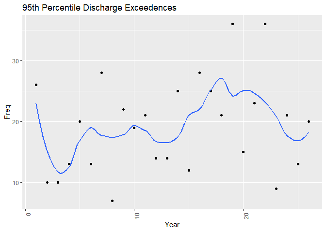<!-- -->

Is a trend evident? It is not too clear. From visual inspection, it
appears as though the frequency of flow exceedences above the 95th
percentile might be increasing. We choose the Mann-Kendall statistical
test to characterize significance of the trend. This test is a
non-parametric test used to identify a trend in a series:

``` r
MannKendall(df_freq$Freq)
```

    ## tau = 0.154, 2-sided pvalue =0.28849

Because the null hypothesis of the Mann-Kendall test states that there
is no trend in the series, the results show that we must fail to reject
the null (tau = 0.15, p = 0.29). At the 95% confidence level, there is
not enough evidence to suggest that there is a trend in the series.
